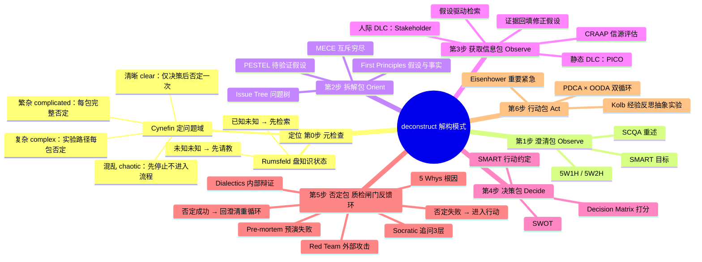
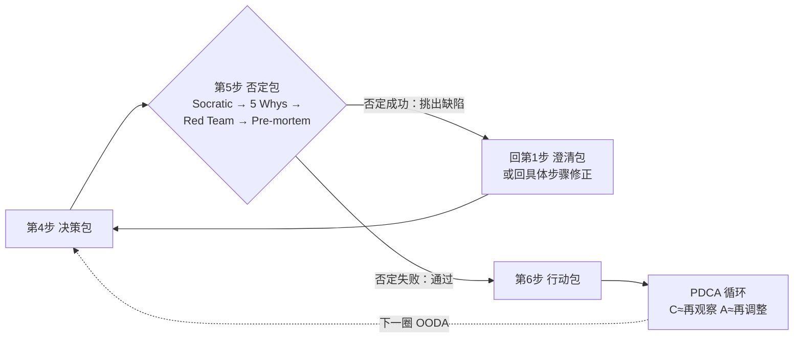

# deconstruct-MyQuestion-skill

> **⚠️ 本 README 由 AI 自动生成，纯自用仓库，懒得手写。** 内容仅供参考，不保证准确，不接收 issue。

解构模式（Deconstruct Mode）——一个为 DeepSeek Harness (DSH) 设计的互动式问题拆解 skill。像 /plan 一样工作，但更彻底：把一次完整的问题解决过程组织为一次 OODA 循环，从澄清、拆解、取证、决策到执行前红队审查，每一步都要求用户确认后再推进。

> 核心心法：**先确认方法，再开始做事。方法对了，可能一下就解决；方法错了，研究越久越糟糕。**

## 特性

- **固定流程**：不是自由聊天，每步一个标准提问，等用户回答后进入下一步
- **OODA 架构**：Observe 出现两次（第 1 步澄清 + 第 3 步获取信息），外加循环前的定位与执行前的质检闸门
- **否定反馈环**：第 5 步否定检查不是单向闸门——否定成功回澄清包重循环，否定失败才进入行动
- **Cynefin 否定分级**：clear 仅决策后一次否定；complicated / complex 每包后完整否定；chaotic 先停止
- **PDCA × OODA 双循环**：P≈OOD、D≈A、C≈下一圈 Observe、A≈下一圈 Orient+Decide
- **工具按包组织**：工具不零散调用，按"包"挂载到对应步骤，包内分工顺序固定
- **用户控制**：支持 `继续` / `跳步` / `全部` / `停止` / `深入` 指令

## 安装

将 `deconstruct` 目录放入 DSH 的 skills 目录：

```bash
# 本仓库克隆后
cp -r deconstruct ~/.dsh/skills/
```

确认 skill 已被识别（会话中应出现 deconstruct skill 条目）。

## 用法

```
/deconstruct <你的问题>
```

例如：

```
/deconstruct 我想了解医学新闻
/deconstruct 要不要换工作
/deconstruct 毕业论文选题怎么定
```

## 流程架构（v2）

整个流程 = 一次 OODA 循环 + 循环前"定位" + 执行前"质检闸门"（反馈环）：



### 否定反馈环



## 工具包一览

| 包名 | 挂载 | OODA 环节 | 组成 |
| --- | --- | --- | --- |
| 澄清包 | 第 1 步 | Observe | 5W1H/5W2H → SMART → SCQA |
| 拆解包 | 第 2 步 | Orient | Issue Tree → MECE → First Principles → PEST/PESTEL（待验证假设） |
| 获取信息包 | 第 3 步 | Observe | 假设驱动检索 → CRAAP 信源评估 → 静态 DLC：PICO / 人际 DLC：Stakeholder → Power-Interest Grid |
| 决策包 | 第 4 步 | Decide | SWOT → Decision Matrix → SMART |
| 否定包 | 第 5 步 | 质检闸门（反馈环） | Socratic Method → 5 Whys → Red Team/Dialectics → Pre-mortem |
| 行动包 | 第 6 步 | Act | PDCA × OODA 双循环 + Eisenhower Matrix；学习任务额外套 Kolb |

## 否定分级（Cynefin 决定否定强度）

| 问题域 | 流程 | 否定强度 |
| --- | --- | --- |
| clear（清晰） | 完整流程 | 仅决策包后一次（完整四件套） |
| complicated（繁杂） | 完整流程 | 每包后完整四件套 + 决策包后最大否定 |
| complex（复杂） | 实验路径（跳过第 3、4 步） | 每个实际经过的包后完整四件套 |
| chaotic（混乱） | 先停止，不进流程 | 不进入流程（澄清转域后按新域规则） |

## PDCA × OODA 双循环

两模型是同一个旋转的圆——OODA 管"想清楚"，PDCA 管"执行好"，共享反馈精神：

- **P ≈ OOD**：决策前思考环（观察→判断→决策）
- **D ≈ A**：执行，唯一严格一一对应的一环
- **C ≈ 下一圈 Observe**：检查 = 对执行结果的再观察，不是 A
- **A ≈ 下一圈 Orient + Decide**：根据反馈调整 = 再判断再决策

> 一次 PDCA 循环 = OODA 决策 → 行动 → 再观察 → 再调整

## 用户控制指令

- **直接回答**：可以选 A/B/C，也可以自由输入
- `继续`：当前步骤用合理默认值推进
- `跳步`：跳过当前步骤
- `全部`：不再交互，一次性输出完整解构
- `停止`：结束本次解构
- `深入`：对当前步骤递归否定检查

## 文件结构

```
deconstruct/
└── SKILL.md     # skill 定义与完整流程说明
```

## License

MIT
